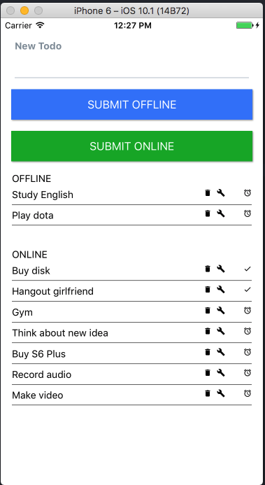

# Introduce


This App is built on React Native + Redux + Apollo(GraphQL)
The features in app:
  + Get All Data
  + Push task on server

# Install

1. Install dependence package
```
yarn install
```
or
```
npm install
```
2. Link package to app
```
react-native link
```

# Run
1. Run server

```
node run_server.js
```
2. Run App
1.Android
```
react-native run-android
```
2. Ios
```
react-native run-ios
```
3. Web
open : http://localhost:8000/graphql

# Contribute

If it's helpful for you, give me a star <3
